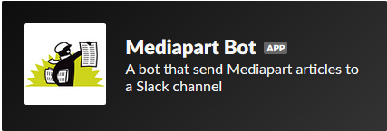

# Mediapart Slack Bot 

**[DISCLAIMER] The purpose of this bot is not to bypass Mediapart subscription. [Please support their work](https://www.mediapart.fr/abo/abonnement/normal).**
  

  
  

##  Summary
1. [Main functionalities](#main-functionalities) 
2. [Deployment procedure](#deployment-procedure)
3. [Bot commands](#bot-commands)

## 1. Main functionalities
* Retrieve Mediapart articles (only in french for the moment) each hour (configurable) and download then as PDF.
* Send the articles into a slack text channel (configurable).

## 2. Deployment procedure

The installation procedure is given for Linux system (like [Ubuntu](https://ubuntu.com/)) but the bot is packaged as a Docker image, so it should work on all [Docker supported systems](https://docs.docker.com/engine/install/).

### Install docker

 The first step is to install Docker on your system.

> `apt update`  
> `apt install docker.io`

### Pull image

In the following command you need to replace the field `version` with the version you want to deploy.  
Most of the time it will be the latest version available [here](https://github.com/r0perice/mediapart-slack-bot/packages/269328).
> `docker pull docker.pkg.github.com/r0perice/mediapart-slack-bot/mediapart-slack-bot:version`

### Run the image

> `docker run -e MEDIAPART_USER="user_name" -e MEDIAPART_PWD="user_pwd" -e SLACKS_BOT_TOKEN="slack_token" -e CHANNEL_ID="channel_id" -v mediapart-slack-bot-data:/tmp/mediapart_bot -it -d mediapart-slack-bot:version`

* `MEDIAPART_USER`: your Mediapart user name
* `MEDIAPART_PWD`: your Mediapart password
* `SLACK_BOT_TOKEN`: the Bot User OAuth Access Token
* `CHANNEL_ID`: the id of the slack channel you want the Mediapart articles to appear (eg: "#mediapart")
* `version`: the version of the bot you want to deploy (usually [latest version](https://github.com/r0perice/mediapart-slack-bot/packages/286811))
* (optional) `BOT_FETCH_TIME_HOURS`: the articles fetch time in hours, default is 1 hour.
* (optional) `mediapart-slack-bot-data:/tmp/mediapart_bot`: on the left it is the name of the volume inside the container, on the right the folder on the host
